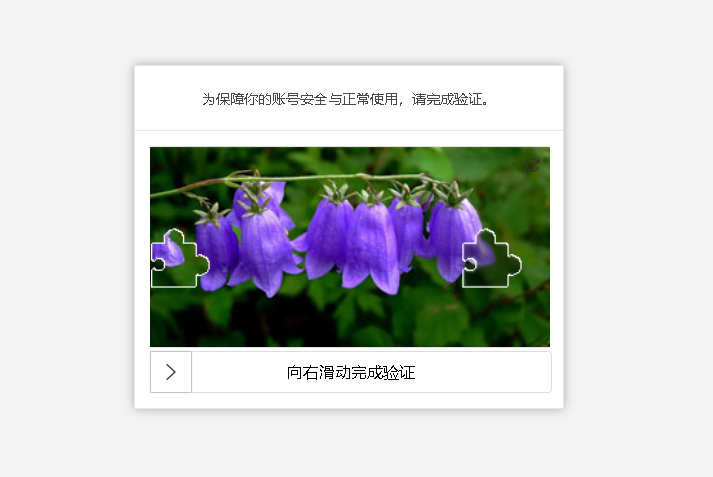
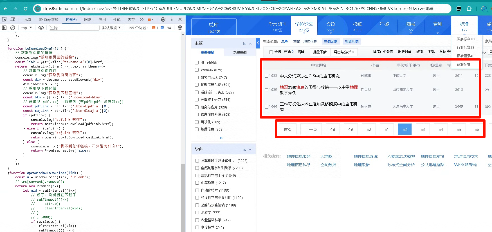

# 知网自动下载

- 下面是油猴插件



```javascript
// ==UserScript==
// @name         New Userscript
// @namespace    http://tampermonkey.net/
// @version      2024-11-07
// @description  知网验证码（自动跳过）
// @author       You
// @match        https://bar.cnki.net/bar/dist/index.html?*
// @icon         https://www.google.com/s2/favicons?sz=64&domain=cnki.net
// @grant        none
// ==/UserScript==

(function() {
    'use strict';
    function loadImage2Canvas(img) {
        const canvas = document.createElement('canvas');
        canvas.height = img.height;
        canvas.width = img.width;
        const ctx = canvas.getContext('2d');
        ctx.drawImage(img, 0, 0, img.width, img.height, 0, 0, img.width, img.height);
        return {
            canvas,
            ctx,
            imageData: ctx.getImageData(0, 0, img.width, img.height)
        };
    };

    function findWhiteAndCount(can) {
        var height = can.canvas.height;
        var width = can.canvas.width;
        var defaultX = 4;
        var defaultY = 0;
        for (let h = 0;h < height;h++) {
            var index = (h * width + defaultX) * 4;
            var r = can.imageData.data[index];
            var g = can.imageData.data[index + 1];
            var b = can.imageData.data[index + 2];
            var a = can.imageData.data[index + 3];
            if (r === 255 && g === 255 && b === 255 && a === 255) {
                defaultY = h;
                break;
            }
        }
        var whiteCount = 0;
        for (let w = 0;w < width;w++) {
            var index = (defaultY * width + w) * 4;
            var r = can.imageData.data[index];
            var g = can.imageData.data[index + 1];
            var b = can.imageData.data[index + 2];
            var a = can.imageData.data[index + 3];
            if (r === 255 && g === 255 && b === 255 && a === 255) {
                whiteCount++;
            }
        }
        return {
            height: defaultY,
            whiteCount,
            width,
        }
    }

    function findPix(can, obj) {
        var width = can.canvas.width;
        var forWidth = width - obj.width;
        var pixel = -1;
        for (var i = 0;i < forWidth;i++) {
            var index = (obj.height * width + i) * 4;
            var r = can.imageData.data[index];
            var g = can.imageData.data[index + 1];
            var b = can.imageData.data[index + 2];
            var a = can.imageData.data[index + 3];
            var whiteCount = 1;
            if (r === 255 && g === 255 && b === 255 && a === 255) {
                for (var j = 1;j < obj.width;j++) {
                    var index = (obj.height * width + i + j) * 4;
                    var r = can.imageData.data[index];
                    var g = can.imageData.data[index + 1];
                    var b = can.imageData.data[index + 2];
                    var a = can.imageData.data[index + 3];
                    if (r === 255 && g === 255 && b === 255 && a === 255) {
                        whiteCount++;
                    }
                }
                if (whiteCount >= obj.whiteCount) {
                    console.log(`pixel = ${i}`);
                    pixel = i;
                    break;
                }
            }
        }
        return pixel;
    }

    function all() {
        let block = loadImage2Canvas(document.getElementsByClassName('imgBlock')[0]);
        let full = loadImage2Canvas(document.getElementsByClassName('verify-img-panel')[0].childNodes[0]);
        let obj = findWhiteAndCount(block);
        console.log(obj);
        obj.whiteCount -= 5;
        var pixel = findPix(full, obj);
        console.log(`all pixel = ${pixel}`);
        toMove(document.getElementsByClassName('imgBlock')[0], pixel + obj.width);
    }

    // 模拟鼠标事件的函数
    function simulateMouseEvent(element, eventType, clientX, clientY) {
        const event = new MouseEvent(eventType, {
            bubbles: true,
            cancelable: true,
            clientX: clientX,
            clientY: clientY,
        });
        element.dispatchEvent(event);
    }
    function toMove(dom, xmove) {
        // let dom = document.getElementsByClassName('imgBlock')[0];
        const rectA = dom.getBoundingClientRect();
        const startX = rectA.left + rectA.width / 2;
        const startY = rectA.top + rectA.height / 2;
        const targetX = startX + xmove;
        const targetY = startY;
        // 1. 模拟鼠标按下在 A 上
        simulateMouseEvent(dom, 'mousedown', startX, startY);

        // 2. 模拟鼠标移动到 B 的位置
        simulateMouseEvent(document, 'mousemove', targetX, targetY);

        // 3. 模拟鼠标释放
        simulateMouseEvent(document, 'mouseup', targetX, targetY);
    }

    function toWait(time, title) {
        let tid = setInterval(() => {
            if (time) {
                document.body.innerHTML = `<div style="height:100vh;width:100vw;">${title} 请等待，${time} 秒之后自动退出</div>`
            }
            time--;
        }, 1000);
    };
    setTimeout(() => {
        let id = setInterval(() => {
            let dom = document.getElementsByClassName('imgBlock')[0];
            if (dom) {
                all();
            } else {
                // 判断是否好了
                let content = document.body.innerText;
                let waitTime = -1;
                if (content.includes("验证成功")) {
                    toWait(3, "验证成功了");
                    waitTime = 3000;
                } else if (content.includes("null")) {
                    toWait(6, "不知道为什么null")
                    waitTime = 6000;
                } else if (content.includes("请稍后重试")) {
                    waitTime = 10000;
                    toWait(10, "不重试")
                }
                if (waitTime !== -1) {
                    console.log("over");
                    clearInterval(id);
                    setTimeout(() => {
                        window.close();
                    }, waitTime)
                }
            }
        }, 5000);
    }, 10000);
    // Your code here...
})();
```

- 自动退出错误页插件

```javascript
// ==UserScript==
// @name         New Userscript
// @namespace    http://tampermonkey.net/
// @version      2024-11-07
// @description  try to take over the world!
// @author       You
// @match        https://bar.cnki.net/bar/ErrorMsg.html?*
// @icon         https://www.google.com/s2/favicons?sz=64&domain=cnki.net
// @grant        none
// ==/UserScript==

(function() {
    'use strict';
    function toWait(time, title) {
        let tid = setInterval(() => {
            if (time) {
                document.body.innerHTML = `<div style="height:100vh;width:100vw;">${title} 请等待，${time} 秒之后自动退出</div>`
            }
            time--;
        }, 1000);
    };
    toWait(10, "算了，等下就退了");
    setTimeout(() => {
        window.close();
    },10000);
    // Your code here...
})();
```

- 下方运行 auto() 开始自动下载（放在控制台执行即可）



```javascript
function auto() {
    let running = false;
    let id = setInterval(()=>{
        if (running) {} else {
            running = true;
            nextPage().then(()=>{
                running = false;
            }
            );
        }
    }
    , 1000);
}

function nextPage() {
    return new Promise(s=>{
        let id = setInterval(()=>{
            const downloadTr = $('.result-table-list tbody tr');
            if (downloadTr.length) {
                clearInterval(id);
                console.log("获取到下载内容");
                return toDownload(downloadTr).then(()=>{
                    $('#PageNext').click();
                    $('.result-table-list tbody').remove();
                    s(true);
                }
                );
            }
        }
        , 100);
    }
    );
}
function toDownload(trs) {
    let total = trs.length;
    console.log(`开始下载，文章数量:${total}`);
    let running = false;
    let current = 0;
    return new Promise(s=>{
        var id = setInterval(()=>{
            if (running) {} else {
                running = true;
                if (current < total) {
                    return toDownloadOneTr($(trs[current])).then(()=>{
                        current++;
                        running = false;
                    }
                    );
                    /*const link = $(trs[current]).find('td.operat a.downloadlink')[0].href;
w = window.open(link, '_blank');
// trs[current].remove();
let wid = setInterval(() => {
if (w.closed) {
current++;
running = false;
}
}, 1000);*/
                } else {
                    console.log("下载完成");
                    clearInterval(id);
                    s(true);
                }
            }
        }
        , 100);
    }
    );
};
function toDownloadOneTr(tr) {
    // 获取到页面的链接
    console.log("获取到页面的链接");
    const link = $(tr).find('td.name a')[0].href;
    return fetch(link).then(_=>_.text()).then(r=>{
        // 获取到页面内容
        console.log("获取到页面内容");
        const div = document.createElement('div')
        div.innerHTML = r;
        // 获取到下载区域
        console.log("获取到下载区域");
        const btn = $(div).find('.download-btns');
        // 获取到 pdf、caj 下载按钮 (有pdf用pdf，没有就caj)
        const pdfLink = btn.find('.btn-dlpdf a')[0];
        const cajLink = btn.find('.btn-dlcaj a')[0];
        tr.remove();
        if (pdfLink) {
            console.log("pdfLink 有效");
            return openWindowToDownload(pdfLink.href);
        } else if (cajLink) {
            console.log("cajLink 有效");
            return openWindowToDownload(cajLink.href);
        } else {
            console.error("找不到任何链接，不知道为什么!");
            return Promise.resolve(false);
        }
    }
    );
};
function openWindowToDownload(link) {
    const w = window.open(link, '_blank');
    window.ow = w;
    // trs[current].remove();
    return new Promise(s=>{
        let wid = setInterval(()=>{
            // 好了，浏览器在下载了
            // setTimeout(()=>{
            //     s(true);
            //     clearInterval(wid);
            // }
            // , 5000);
            if (w.closed) {
                clearInterval(wid);
                setTimeout(() => {
                    s(true);
                }, 10000);
            }
        }
        , 1000);
    }
    );
};
```